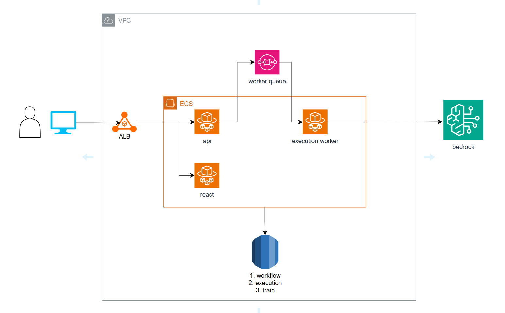
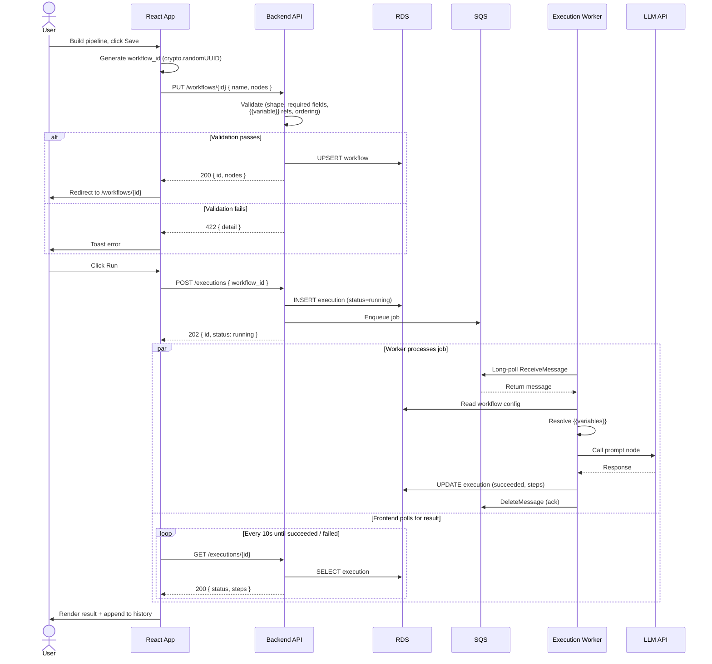
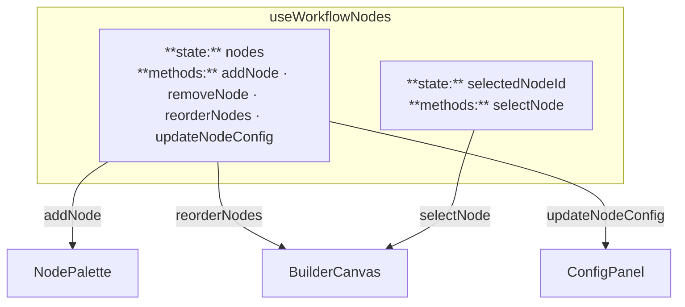

# mini-workflow-builder

A micro-agent workflow builder POC — drag-and-drop nodes to create linear AI pipelines.

## Quick Start

1. Run Docker Desktop
2. Create `backend/.env` with your OpenAI API key:

```
OPENAI_API_KEY=your-api-key-here
```

3. Run the commands below:

```bash
git clone <repo-url>
cd mini-workflow-builder
docker compose up --build
```

4. Open http://localhost:3000

## System Architecture



## Sequence Diagram

End-to-end flow: save a new workflow, then run it and poll for the result.



> **Note:** Workflows are immutable — there is no edit endpoint. The client generates the workflow ID (`crypto.randomUUID()`) up front and `PUT`s to that URL, which makes save idempotent and avoids any temp-ID/real-ID swap. To change a workflow, clone it (new ID, new PUT).

## Schema

For the current DB and JSON-blob schemas (with a "consumed by" column for each field), see [`docs/schema.md`](docs/schema.md).

## Architectural Choices & Trade-offs

**Assumptions:** Internal tool, ~100 concurrent users.

### API for Executing a Pipeline — Request-Response vs Polling vs SSE

Workflow execution involves long-running tasks (DB queries, LLM calls). A normal request-response pattern won't work here — the connection would time out or block the server while waiting for the result.

Instead, `POST /api/executions/{workflow_id}` returns immediately with an execution ID, and the frontend checks for results separately. The question is how — polling (frontend asks repeatedly) or SSE (server pushes updates over a persistent connection).

**At ~100 concurrent users, polling is the right choice:**

|                       | Polling                                                                     | SSE                                                                                                                                                                             |
| --------------------- | --------------------------------------------------------------------------- | ------------------------------------------------------------------------------------------------------------------------------------------------------------------------------- |
| **DB load**           | 100 users × poll every 5s = 20 reads/s — trivial for a single record lookup | Near zero — server pushes only on change                                                                                                                                        |
| **Design complexity** | Stateless — any network failure, next poll picks up the latest state        | Connection must stay open. Adds complexity: <br>• Frontend must handle reconnection on any network failure <br>• Load balancers must be configured to not kill idle connections |

**When to re-evaluate:** Monitor DB read load from polling. If the execution table queries start slowing down because too many clients are polling for status, it's time to switch to SSE.

### Where Execution Runs — In-Process vs Worker vs Message Queue

Once the API accepts an execution request, something needs to run the pipeline. The question is where.

|                    | In API Layer                              | API → Worker (HTTP)                 | API → SQS → Worker                         |
| ------------------ | ----------------------------------------- | ----------------------------------- | ------------------------------------------ |
| **Blast radius**   | High — execution crash takes down the API | Isolated                            | Isolated                                   |
| **Worker crash**   | Execution lost                            | Execution lost                      | Queue retries automatically                |
| **Infrastructure** | None                                      | Extra deployment for worker service | Extra deployment + SQS + dead letter queue |

- **Choice:** API → SQS → Worker — if the worker crashes, the message reappears in the queue and another worker picks it up. Nothing is lost.
- **Why not in API layer:** Execution and API share the same process. If it crashes, all running executions are lost with no retry.
- **Step-level retry:** If retrying the entire pipeline is too costly, track each step's status in a DB so execution can resume from the failed step. Not considered for now — pipelines are assumed not costly to rerun.

### LLM Integration — Rate Limiting

At ~100 concurrent users, workers call OpenAI directly — the request volume is well within API rate limits. If we scale to more workers and start hitting 429s, introduce a centralized rate limiter (DynamoDB or Redis) so workers coordinate instead of each independently exceeding the limit.

### Database — RDS

| Table          | Choice | Why                                                                                                                                                   |
| -------------- | ------ | ----------------------------------------------------------------------------------------------------------------------------------------------------- |
| **train**      | RDS    | Analytics queries — aggregate, filter, average delays by station                                                                                      |
| **workflows**  | RDS    | Both work. Key-retrieval pattern suits NoSQL, but not write-heavy and RDS is already in the stack. Node configs stored as JSON column for flexibility |
| **executions** | RDS    | Same as workflows — fetched by ID or listed by workflow ID. Execution steps stored as JSON column                                                     |

> **Schema derivation** — for *why* each column exists (UI sketch → data each panel renders → schema columns that fall out), see [`docs/development.md` § Page Design & Schema Derivation](docs/development.md#page-design--schema-derivation).

### Workflow Configuration Modification — Edit in Place vs Clone

When a user wants to change a workflow, there are two approaches: edit the existing one, or clone it as a new workflow. The problem with editing is that past executions ran on the old version — if the workflow changes, the execution history no longer matches what actually ran.

|                         | Edit in Place                                            | Clone                                           |
| ----------------------- | -------------------------------------------------------- | ----------------------------------------------- |
| **Execution history**   | Can become inaccurate — workflow changed after execution | Always accurate — workflow never changes        |
| **Workflow ID meaning** | Unstable — same ID, different behaviour over time        | Stable — same ID always means the same pipeline |
| **User friction**       | Lower — edit and re-run                                  | Slightly higher — clone first, then edit        |

**Choice:** Immutable config (clone). A workflow ID is a stable contract — "run workflow X" means the same thing today as it does next month. Structural changes are intentional and consequential, so making them explicit (via clone) is the right trade-off. Most re-runs only need different input values, not structural changes.

### Routing — ALB

ALB over API Gateway — internal tool, don't need API keys, usage plans, or per-consumer monitoring. ALB over self-managed Nginx — ALB integrates natively with ECS (health checks, target groups, auto-scaling) without managing another container.

### Frontend State Management

**Server state** is managed by TanStack Query — handles caching, polling, and cache invalidation (e.g. invalidating execution history after a new run completes).

**Builder state** is the more complex case. The builder screen has a drag-and-drop canvas (React Flow) for ordering nodes, a side panel for configuring the selected node, and a palette for adding new nodes. A single hook (`useWorkflowNodes`) centralizes all builder state and operations in one place:



Every component in the builder reads from and writes through this one hook . Zustand/Redux isn't needed for now because the state is scoped to a single page — there's nothing to share across routes, so a global store adds complexity with no benefit.

## What I'd Do With 2 More Weeks

- **Clarify user needs** — Ask more questions to uncover pain points before building. E.g. is it one builder, multiple executors? Do they need a scheduler or is press-and-run enough? The goal is to make sure no answer requires a major rework of the current architecture.
- **Validate linear-only assumption** — Branching is the biggest risk. If users need conditional paths (if tool returns X, go left; otherwise go right), it changes both frontend state (edges become first-class, not derived from order) and backend validation (cycle detection, topological execution).
- **Dynamic inputs at execution time** — Currently input values are baked into the workflow config. Change the execution screen to accept inputs per run so users don't need to touch the builder.
- **Frontend variable validation — fail fast** — Today, broken `{{variable}}` references (e.g. after a reorder) are only caught on Save via the backend 422. Move the validation rule into the builder so the affected node shows an inline error the moment the reference becomes invalid, instead of waiting until save.
