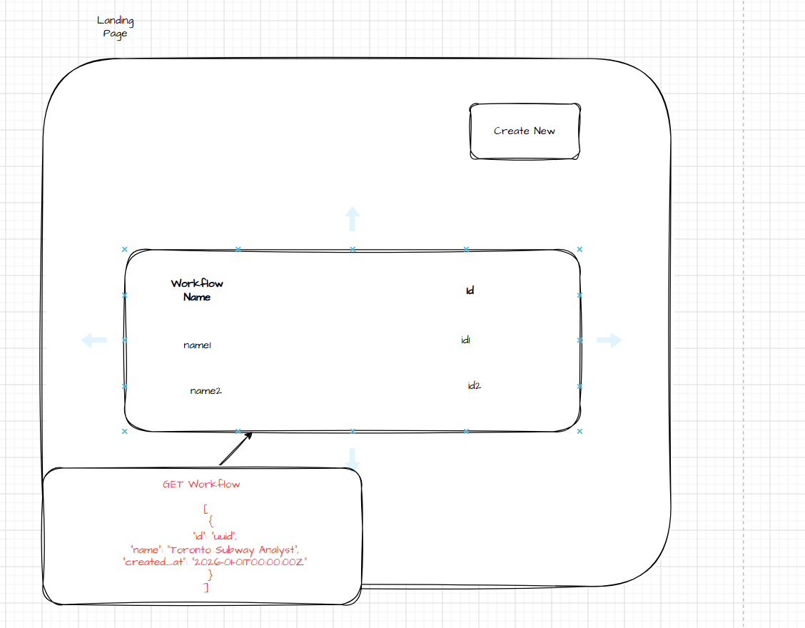
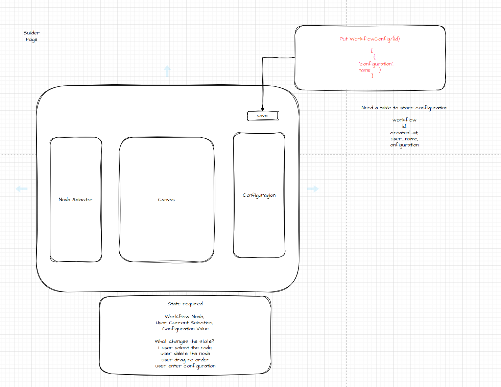
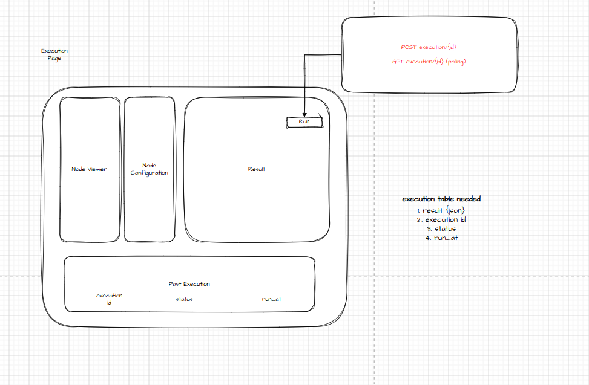

# Development Notes

## What We're Building

A **Micro-Agent Workflow Builder** — users chain three node types into a sequential pipeline, save it, and run it. Default scenario is the Toronto Subway Data Analyst (Input → Tool → Prompt).

**Hard constraints:**

- A node can only reference variables produced by **strictly preceding** nodes
- Execution must integrate a **real LLM API** (OpenAI used here)
- Toronto Subway pipeline must be the default-loaded or easily loadable workflow
- Must be reproducible locally (Docker Compose)

**What's evaluated:** system design, modularity, state management, documentation. Not visual polish, not LLM accuracy.

**Time budget:** a weekend.

---

## User Stories

### US-1 — Build a new pipeline
Land on `/workflows` → **New** → builder. Add Input/Tool/Prompt nodes, configure each, click **Save**. Builder has Save only — no Run. Workflow ID is generated by the frontend (`crypto.randomUUID()`) and PUT to `/workflows/{id}`.

### US-2 — Run a saved workflow
Open `/workflows/{id}` → **Run** → `POST /executions`. Frontend polls `GET /executions/{id}` until succeeded/failed. New execution appended to history.

> Workflows are immutable — to re-run with different inputs, create a new workflow.

### US-3 — View execution history
Past executions listed at the bottom of the detail page (id, timestamp, status). Click a row → step-by-step output expands inline. Read-only.

---

## Page Design & Schema Derivation

Schema falls out of what each page renders.

### Page 1 — Landing

### Page 2 — Builder

### Page 3 — Execution

---

## API Endpoints

| Method | Path                             | Purpose                                                |
| ------ | -------------------------------- | ------------------------------------------------------ |
| `GET`  | `/workflows`                     | List all workflows (id, name, created_at)              |
| `GET`  | `/workflows/{id}`                | Load full workflow with nodes                          |
| `PUT`  | `/workflows/{id}`                | Create workflow (immutable; client-generated ID)       |
| `POST` | `/executions`                    | Start a run for a `workflow_id`; returns execution id  |
| `GET`  | `/executions/{id}`               | Poll status + steps until terminal state               |
| `GET`  | `/executions?workflow_id={id}`   | List past executions for a workflow                    |

Schema details and per-field consumers are in [`schema.md`](schema.md).

**Validation rules** (enforced server-side on save):
- `type` ∈ {`input`, `tool`, `prompt`}; required config keys present per type
- `{{variable}}` refs must resolve to a **strictly preceding** node
- `order` sequential starting from 1

Validation failures return `422` with `{ "detail": "..." }` — frontend toasts the message.

---

## Decisions

The actual debates that shaped the build, with how they resolved.

### 1. Save = `PUT /workflows/{id}`, not `POST /workflows`
Client generates the UUID up front and PUTs to that URL. Save is idempotent (safe to retry, double-click, network glitch) and there's no temp-ID/real-ID swap on the frontend. Combined with immutability, the endpoint is effectively create-only.

### 2. Workflows are immutable — no edit endpoint
Considered an in-place edit with a `version` integer. Dropped it: workflow ID as a stable contract is more valuable than the slight UX win of edit. Past executions stay accurate without snapshotting config. The schema briefly carried `version` and `updated_at` columns; both were removed once the design settled (one less thing to lie about).

### 3. `nodes` and `steps` stored as JSON blobs
`workflows.nodes_json` and `executions.steps_json` are `Text` columns, not normalized tables. No query ever reaches inside them — the canvas reads the whole node array, the executor reads the whole step list. Adding a `workflow_nodes` table would mean a join with no payoff.

### 4. Linear pipeline only — edges derived from `order`
No branching, no cycle detection, no topological execution. Edges aren't stored at all — `node[i] → node[i+1]` is implied. Biggest risk if requirements change to allow conditional paths; flagged as the top "extra two weeks" item.

### 5. Polling, not SSE
At ~100 users, polling = ~20 reads/s on a single-row lookup. Trivial. SSE would add reconnection logic on the client and idle-connection config on the load balancer for no payoff at this scale. Re-evaluate when DB read load shows up in metrics.

### 6. In-process execution via FastAPI `BackgroundTasks` (not SQS) for the POC
Zero infrastructure overhead for the weekend scope. Production target is API → SQS → worker (see system diagram). Service layer is structured so the executor can be moved to a Celery task or SQS consumer without changes to its logic.

### 7. Tool list hardcoded on the frontend
`web/src/config/tools.ts` mirrors `backend/app/tools/registry.py`. Drift between the two is the explicit cost of not building a `GET /tools` endpoint yet. Acceptable for the POC; flagged in scope cuts.

### 8. Variable reference validation on backend, not in the builder
Zod handles shape ("required field present, type correct") on the frontend. The cross-node `{{var}}` resolution check lives in the backend validator — frontend doesn't fail-fast on a broken reference after a reorder. Cheap to add inline UI errors later; deferred to "extra two weeks".

---

## Tech Stack

| Library                | Why                                                                                 |
| ---------------------- | ----------------------------------------------------------------------------------- |
| **React + TypeScript** | Foundation. TypeScript catches config shape mismatches early                        |
| **Vite**               | Build tool, fast dev server                                                         |
| **React Router v6**    | 3 screens, need client-side routing                                                 |
| **TanStack Query**     | Data fetching + built-in polling for the execution loop                             |
| **TanStack Table**     | Headless table primitives for workflow list + execution history                     |
| **React Flow**         | Drag-and-drop canvas, node connections                                              |
| **Zod**                | Schema validation on save                                                           |
| **Tailwind + shadcn/ui** | Utility CSS + pre-built primitives — no styling rabbit hole                       |
| **Axios**              | HTTP client                                                                         |
| **React `useState`**   | Local UI state and node config forms — at most 2–3 fields per node                  |

**Why not Zustand:** state is page-scoped. Server state lives in TanStack Query, canvas state in React Flow, and the small amount of builder state lives in one hook (`useWorkflowNodes`). A global store adds complexity with no benefit.

**Why not React Hook Form:** node config forms have at most 2–3 fields. RHF earns its keep on large forms with dirty tracking, async validation, and field arrays — none of which we need.

---

## Scope Cuts (intentional — not architectural compromises)

- **No workflow rename / delete** — set on creation, persists forever
- **No execution cancellation** — once `POST /executions` fires, it runs to completion
- **No auth** — assumed; user is implicit
- **No partial execution recovery** — node fails → status flips to `failed`, run stops
- **Tool list hardcoded on the frontend** — backend `TOOL_REGISTRY` kept in sync manually

**What stays sound architecturally** (we don't cut these even though they'd be faster):

- Async execution + polling — production pattern; HTTP shouldn't block on LLM calls
- Resource separation (`/workflows` vs `/executions`) — clean REST design
- Single source of truth in builder (`WorkflowNode[]`) — every panel derives from it
- Free-form `config` validated per type — extensible without API breakage
- Client-generated UUIDs — no temp/real ID swap on save
